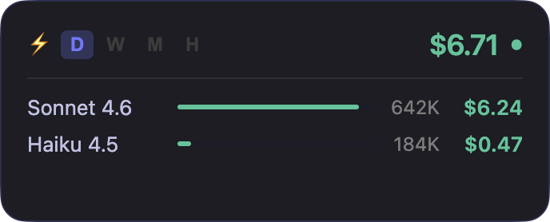

# claude-widget

A lightweight, always-on-top desktop widget that tracks your **Claude AI usage and costs in real time** — built with Electron, React, and TypeScript.


---

## What is claude-widget?

claude-widget sits in a corner of your screen and quietly watches your `~/.claude` session logs. It parses JSONL conversation files in real time, calculates token costs per model, and surfaces a clean cost breakdown — so you always know how much you're spending on Claude without opening a browser or checking invoices.



---

## Key Features

- **Real-time cost tracking** — reads live session JSONL logs from `~/.claude` as you work
- **Always-on-top transparent widget** — stays visible on all workspaces, even over fullscreen apps
- **D / W / M period switcher** — instantly flip between today, this week, and this month
- **Per-model cost breakdown** — bar charts show spend split across Sonnet, Opus, and Haiku
- **Daily breakdown** — weekly and monthly views show day-by-day cost bars
- **Live session indicator** — a green dot appears when Claude is actively running
- **Auto-resizing** — widget height adjusts to content, no empty space
- **Persistent position** — remembers where you placed it across restarts
- **Accurate pricing** — built-in rates for input, output, cache-write, and cache-read tokens per model
- **Cross-platform** — macOS (primary), Windows, and Linux

---

## Quickstart

### Prerequisites

- [Node.js](https://nodejs.org/) 18+
- [Claude Code](https://claude.ai/code) or any Claude CLI that writes session logs to `~/.claude`

### Install & Run

```bash
# Clone the repo
git clone https://github.com/your-username/claude-widget.git
cd claude-widget

# Install dependencies
npm install

# Start in development mode
npm run dev
```

The widget will appear in the bottom-right corner of your screen.

### Build for Production

```bash
# macOS (produces .dmg)
npm run build:mac

# Windows (produces .exe installer)
npm run build:win

# Linux (produces AppImage, .snap, .deb)
npm run build:linux
```

Artifacts are placed in the `dist/` folder.

---

## How It Works

```
~/.claude/**/*.jsonl  →  file-watcher  →  usage-parser  →  IPC  →  UsageWidget
```

1. **file-watcher** monitors `~/.claude` for new/changed JSONL log files using `chokidar`
2. **usage-parser** extracts token counts (`input`, `output`, `cache_creation`, `cache_read`) and maps them to the correct model
3. **pricing-fetcher** keeps model rates up to date
4. **UsageWidget** renders a glassmorphism panel with period totals, model rows, and day bars

---

## Supported Models & Pricing

| Model | Input | Output | Cache Write | Cache Read |
|-------|-------|--------|-------------|------------|
| claude-sonnet-4-6 | $3.00 / M | $15.00 / M | $3.75 / M | $0.30 / M |
| claude-opus-4-7 | $5.00 / M | $25.00 / M | $6.25 / M | $0.50 / M |
| claude-haiku-4-5 | $1.00 / M | $5.00 / M | $1.25 / M | $0.10 / M |

Pricing is stored in `src/shared/types.ts` and can be updated as Anthropic adjusts rates.

---

## Project Structure

```
src/
├── main/
│   ├── index.ts            # Electron main process, window setup
│   ├── ipc-handlers.ts     # IPC bridge between main and renderer
│   ├── file-watcher.ts     # Watches ~/.claude JSONL logs
│   ├── usage-parser.ts     # Token parsing and cost computation
│   └── pricing-fetcher.ts  # Keeps model pricing up to date
├── renderer/src/
│   ├── App.tsx             # Root component
│   ├── components/
│   │   └── UsageWidget.tsx # Main widget UI
│   └── hooks/
│       └── use-usage-data.ts
├── shared/
│   └── types.ts            # Shared types, model pricing, context limits
└── preload/
```

---

## Development

```bash
# Type-check all packages
npm run typecheck

# Lint
npm run lint

# Format
npm run format

# Run tests
npm test
```

### Recommended IDE

[VSCode](https://code.visualstudio.com/) with the following extensions:
- [ESLint](https://marketplace.visualstudio.com/items?itemName=dbaeumer.vscode-eslint)
- [Prettier](https://marketplace.visualstudio.com/items?itemName=esbenp.prettier-vscode)

---

## Contributing

Contributions are welcome! Please read [CONTRIBUTING.md](CONTRIBUTING.md) for the full guide — branching, commit convention, code style, and good first issues.

---

## License

MIT © [maxyzx](LICENSE)
